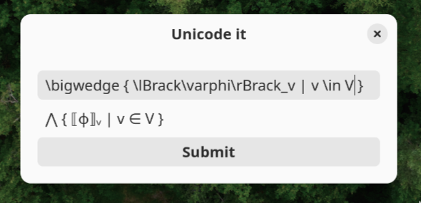

# Unicode it GTK

This is a GTK IME popup for entering symbols via (La)TeX - a simple wrapper around the [unicodeit Python library](https://github.com/svenkreiss/unicodeit).

## Usage

The popup window can be launched via the Python script [`bin/unicodeit-gtk`](./bin/unicodeit-gtk). It can be closed via the escape button. Pressing enter or clicking the button will try to input the corresponding Unicode characters via [wtype](https://github.com/atx/wtype).

Since starting a GTK application is not instantaneous, an alternative is provided by [`bin/unicodeit-gtk-daemon`](./bin/unicodeit-gtk-daemon). Once started, the daemon will listen to SIGUSR1 and then a window will pop up. This can be useful when the following command is bound to a keyboard shortcut:

    pkill -SIGUSR1 unicodeit-gtk

## Installation

The two hard prerequisites are a supported version of Python and GTK4. The `wtype` binary is also a prerequisite, although the launch script can be easily modified to use alternatives.

The following steps are sufficient:

* Make use [`poetry`](https://python-poetry.org/) is installed.
* Clone the repository.
* Run `poetry install`.
* Run `pip install [--user] dist/*.whl`
* Make sure `bin/unicodeit-gtk` and `bin/unicodeit-gtk-daemon` can be found in PATH.
