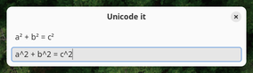
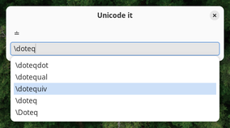

# Unicode it GTK

[](https://aur.archlinux.org/packages/unicodeit-gtk)

This is a GTK IME popup for entering symbols via (La)TeX - a simple wrapper around the [unicodeit Python library](https://github.com/svenkreiss/unicodeit).



There is basic completion implemented:



A benefit of using GTK is that emoji can be entered via "Ctrl+.":


## Usage

The popup window can be launched via the Python script [`bin/unicodeit-gtk`](./bin/unicodeit-gtk).

* `Escape` exists or, if the server has been started, clears any input and hides the popup.
* `Enter` inputs the corresponding Unicode characters via [wtype](https://github.com/atx/wtype)

Since starting a GTK application is not instantaneous, an alternative is provided by [`bin/unicodeit-gtk-server`](./bin/unicodeit-gtk-server). Once started, the server will listen to SIGUSR1 and then a window will pop up. This can be useful when the following command is bound to a keyboard shortcut:

    pkill -SIGUSR1 unicodeit-gtk

## Installation

An [AUR package](https://aur.archlinux.org/packages/unicodeit-gtk) is available.

The two hard prerequisites are a supported version of Python and GTK4. The `wtype` binary is also a prerequisite, although the launch script can be easily modified to use alternatives.

The following steps are sufficient:

* Make sure [`poetry`](https://python-poetry.org/) is installed.
* Clone the repository.
* Build and install via [`pipx`](https://pipx.pypa.io/):
    ```
    poetry install
    poetry build
    pipx install --include-deps dist/*.whl
    ```

    This will install the `unicodeit_gtk` Python module, as well as `unicodeit-gtk` and `unicodeit-gtk-server` executables.

* Alternatively, use the `bin/unicodeit-gtk` and/or `bin/unicodeit-gtk-server` executables.

If you are packaging this for some other package manager, consider using PEP-517 tools as shown in [this PKGBUILD file](https://aur.archlinux.org/cgit/aur.git/tree/PKGBUILD?h=unicodeit-gtk).
